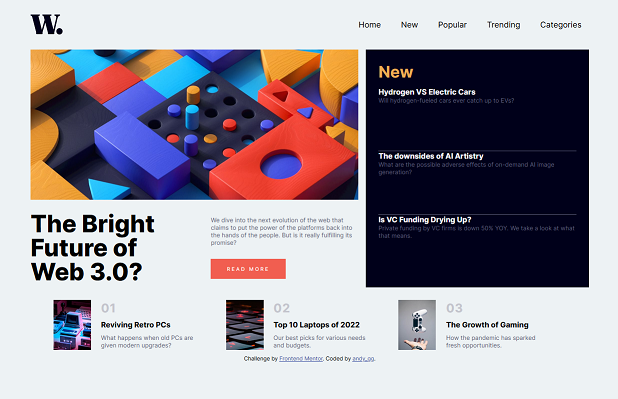
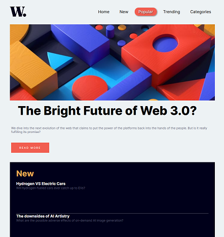
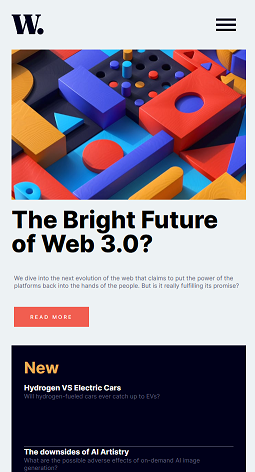

# Frontend Mentor - News homepage solution

This is a solution to the [News homepage challenge on Frontend Mentor](https://www.frontendmentor.io/challenges/news-homepage-H6SWTa1MFl). Frontend Mentor challenges help you improve your coding skills by building realistic projects. 

## Table of contents

- [Overview](#overview)
  - [The challenge](#the-challenge)
  - [Screenshot](#screenshot)
  - [Links](#links)
- [My process](#my-process)
  - [Built with](#built-with)
  - [What I learned](#what-i-learned)
- [Author](#author)

## Overview

### The challenge

Users should be able to:

- View the optimal layout for the interface depending on their device's screen size
- See hover and focus states for all interactive elements on the page

### Screenshot

### Links

- Solution URL: [Solution on GitHub](https://github.com/maximusDecimalusMeridius/news-homepage)
- Live Site URL: [Live site hosted on GitHub Pages](https://maximusDecimalusMeridius.github.io/news-homepage)

## My process

### Built with

- Semantic HTML5 markup
- CSS custom properties
- Flexbox & Grid
- Javascript
- Mobile-first workflow

### What I learned

This project was a nice way to practice analyzing a design, then programatically building the HTML structure, layout, accesibility, responsiveness, design, and functionality.  In a short time, I was able to accurately deliver the design requirements and add animation to the mobile menu with CSS and JS.

## Author

- Website - [Andy G](https://maximusDecimalusMeridius.github.io/dev-portfolio)
- Frontend Mentor - [@maximusDecimalusMeridius](https://www.frontendmentor.io/profile/maximusDecimalusMeridius)
